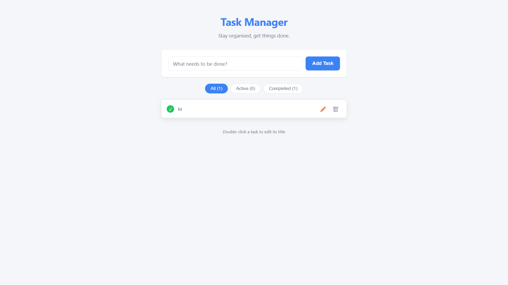

# Task Manager

A full-stack Task Manager application built with React (Vite) and Node.js/Express.

## Features

- **Create** tasks with title
- **View** all tasks in a clean list
- **Mark** tasks as completed (checkbox toggle)
- **Edit** task titles (double-click or edit button)
- **Delete** tasks
- **Filter** tasks by All / Active / Completed
- **Persistent** storage — tasks survive server restarts
- **Validation** on both client and server
- **Error handling** with clear user feedback

## Tech Stack

| Layer | Technology |
|-------|-----------|
| Frontend | React 19 (Vite) |
| Backend | Node.js + Express |
| Storage | In-memory + JSON file persistence |
| Styling | Vanilla CSS |

## Getting Started

### Prerequisites

- Node.js 18+
- npm

### Setup & Run

**1. Clone the repository**

```bash
git clone https://github.com/Kritansh-Tank/Task-Manager
cd Task-Manager
```

**2. Start the backend**

```bash
cd server
npm install
npm run dev
```

Server starts at `http://localhost:5000`.

**3. Start the frontend** (new terminal)

```bash
cd client
npm install
npm run dev
```

App opens at `http://localhost:5173`.

## API Endpoints

| Method | Endpoint | Description |
|--------|----------|-------------|
| GET | `/api/tasks` | Get all tasks |
| POST | `/api/tasks` | Create a task (`{ title }`) |
| PATCH | `/api/tasks/:id` | Update a task (`{ title?, completed? }`) |
| DELETE | `/api/tasks/:id` | Delete a task |

**Response format**: `{ success: boolean, data: ..., error?: string }`

## User Interface



## Project Structure

```
├── server/
│   ├── index.js              # Express entry point
│   ├── routes/tasks.js       # Route definitions
│   ├── controllers/          # Request handlers
│   ├── models/               # Data access layer
│   └── middleware/            # Validation
├── client/
│   └── src/
│       ├── api/              # API wrapper
│       ├── hooks/            # Custom React hooks
│       └── components/       # UI components
└── README.md
```

## Running Tests

```bash
cd server
npm test
```

Runs 13 API tests covering:
- All CRUD operations (GET, POST, PATCH, DELETE)
- Input validation (missing/empty/invalid title, invalid completed)
- Error handling (404 for non-existent tasks and unknown routes)

## Docker Setup

```bash
docker-compose up --build
```

- **Frontend**: http://localhost:3000
- **Backend**: http://localhost:5000
- Task data is persisted via a Docker volume.

## Assumptions & Trade-offs


- **No database** — used JSON file persistence instead of SQLite/Postgres to keep setup simple. Sufficient for a demo app; not production-ready for concurrent users.
- **No authentication** — out of scope for this exercise.
- **Minimal styling** — focused on clean structure and UX (loading states, error messages, validation) over visual polish, as specified in the assignment.
- **No build step for deploy** — dev servers used during development. Run `npm run build` in the client for production if needed.
